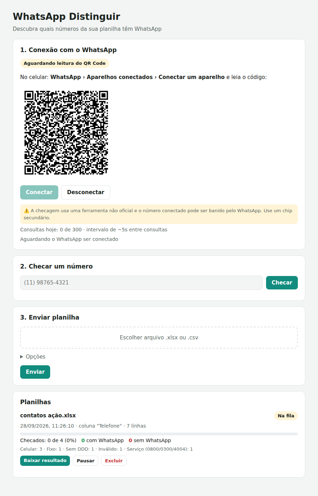

# whatsexeldistinguir

Painel web que lê uma planilha (Excel `.xlsx` ou `.csv`) com telefones e separa quem tem WhatsApp de quem não tem.



Faz duas coisas:

1. **Triagem pelo formato** (sem risco): diz se o número é celular, fixo, sem DDD, inválido, de serviço (0800) ou de outro país.
2. **Checagem real**: conecta um WhatsApp pelo QR Code (como o WhatsApp Web) e pergunta, número por número, se ele está cadastrado.

> ⚠️ **Atenção:** a checagem real usa uma biblioteca **não oficial** (Baileys). Isso vai contra os termos de uso do WhatsApp e **o número conectado pode ser banido**, principalmente com muitas consultas. Use um chip secundário, não o seu número principal.

## Estrutura

| Pasta | O que é |
|---|---|
| `backend/` | API em Node.js: triagem, fila de planilhas, conexão com o WhatsApp. Guarda tudo no volume `/dados` |
| `frontend/` | Painel (HTML/JS) servido pelo nginx, que também repassa `/api` para o backend e pede usuário/senha |
| `docker-compose.yml` | Stack para o Portainer (build a partir do repositório) |
| `docker-compose.imagens.yml` | Stack para o Portainer usando as imagens prontas do GHCR |

## Subir no Portainer

As imagens são publicadas automaticamente no GitHub Container Registry (`ghcr.io/bkpgrupofacil-dev/whatsexeldistinguir-backend` e `-frontend`) a cada push na branch `main`.

**Opção A: pelo repositório (o Portainer faz o build)**

1. Portainer › **Stacks** › **Add stack** › **Repository**.
2. Repository URL: `https://github.com/bkpgrupofacil-dev/whatsexeldistinguir`. Como o repositório é privado, ligue **Authentication** e use seu usuário do GitHub com um *personal access token* (permissão de leitura do repositório).
3. Compose path: `docker-compose.yml`.
4. Em **Environment variables**, adicione pelo menos `APP_SENHA` (veja a tabela abaixo).
5. **Deploy the stack**.

**Opção B: Web editor (usa as imagens prontas do GHCR)**

1. Portainer › **Registries** › **Add registry** › **Custom registry**: URL `ghcr.io`, usuário do GitHub e um token com permissão `read:packages` (as imagens de repositório privado também são privadas).
2. **Stacks** › **Add stack** › **Web editor**: cole o conteúdo de `docker-compose.imagens.yml`.
3. Adicione as variáveis de ambiente e faça o deploy.

Depois, abra `http://SEU-SERVIDOR:8787`, entre com o usuário e a senha, clique em **Conectar** e leia o QR Code com o celular.

### Variáveis de ambiente

| Variável | Padrão | Para quê |
|---|---|---|
| `APP_SENHA` | (obrigatória) | Senha para abrir o painel |
| `APP_USUARIO` | `admin` | Usuário para abrir o painel |
| `PORTA` | `8787` | Porta do painel no servidor (troque se já estiver em uso) |
| `INTERVALO_SEGUNDOS` | `5` | Segundos entre cada consulta ao WhatsApp (com variação de ±30%) |
| `LIMITE_DIARIO` | `300` | Máximo de consultas por dia. Ao atingir, a fila para e continua sozinha no dia seguinte |

Se você usa proxy reverso (Traefik, Nginx Proxy Manager), aponte para o serviço `frontend`, porta 80, e pode remover o `ports:`.

### Dados

Tudo fica no volume `dados` (montado em `/dados` no backend):

- `login-whatsapp/`: sessão do WhatsApp (não precisa ler o QR Code de novo após reiniciar)
- `cache-checagem.json`: respostas já obtidas; um número nunca é consultado duas vezes
- `planilhas/`: planilhas enviadas e o andamento de cada uma
- `uso.json`: quantas consultas foram feitas hoje

## Como funciona o painel

- **Conexão**: mostra o QR Code, o número conectado e quantas consultas foram feitas hoje.
- **Checar um número**: consulta um número avulso na hora.
- **Enviar planilha**: a opção **"Não checar telefones fixos"** vem marcada: fixos quase nunca têm WhatsApp, então não gastam consulta (continuam na planilha, com o formato corrigido, marcados como "Não checado (fixo)"). Marcando **"Apagar telefones fixos da planilha de resultado"**, eles somem da planilha. A triagem sai na hora; a checagem entra numa fila e vai sendo feita aos poucos, respeitando o intervalo e o limite diário. Dá para pausar, continuar e **baixar o resultado a qualquer momento** (com o que já foi checado).

A planilha pode ter **várias colunas de telefone** (ex.: `telefone1`, `telefone2`, `telefone3`...): o sistema acha sozinho todas as colunas cujo nome parece telefone (Telefone, Celular, WhatsApp, Fone...). Para escolher na mão, informe em **Opções** os nomes ou letras separados por vírgula (ex.: `D, E, F`).

A planilha de resultado é a original com os **telefones corrigidos** (só dígitos, DDD + número, ex.: `(88) 99340-8437` vira `88993408437`; números juntos na mesma célula são separados para colunas de telefone vazias; os que não dá para corrigir, como sem DDD, ficam **em amarelo**) e colunas novas no fim:

| Coluna | O que é |
|---|---|
| `<coluna> - tipo` | Para cada coluna de telefone: Celular, Fixo, Sem DDD, Inválido (com o motivo)... |
| `<coluna> - WhatsApp` | Para cada coluna de telefone: **Sim** (verde) / **Não** (vermelho) / Não checado |
| Números com WhatsApp | Os números da linha que têm WhatsApp, já no formato `5585999999999` |
| Tem WhatsApp? | Resumo da linha: **Sim** se algum número tem, **Não** se nenhum tem, ou "Sem número válido" |

## Uso sem Docker (linha de comando)

```bash
cd backend
npm install
node src/cli.js contatos.xlsx --so-triagem   # só triagem
node src/cli.js contatos.xlsx                # triagem + checagem (mostra o QR Code no terminal)
node src/cli.js --ajuda                      # todas as opções
```

## Desenvolvimento

```bash
cd backend && npm install && npm test   # testes
npm start                               # API em http://localhost:3000 (dados em ./dados)
```

Para rodar a stack completa localmente: `APP_SENHA=teste docker compose up --build`.
